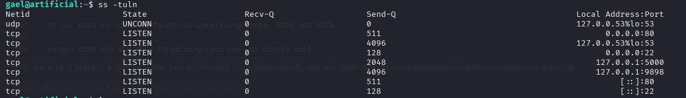

# Artificial (Easy) : 10.10.11.74

## USER.TXT
### Enum and first entry point:
We start with enum using Nmap (ports) => P22/80 => we add artificial.htb in /etc/hosts

`nmap -sC -sV -v 10.10.11.74`

then use Ffuf (Dir, Files and Sub) => **/login** is the most interesting, this will be our entry point

`ffuf -w /usr/share/wordlists/dirbuster/directory-list-2.3-small.txt -u http://artificial.htb/FUZZ`

### exploiting the entry point:

via /login we find the /dashboard page

two main things : 
  1. requirement.txt : tensorflow-cpu==2.13.1
  2. upload filter: .h5 
  
we can use [Tensorflow-RCE](https://github.com/Splinter0/tensorflow-rce) to generate reverse shell with exploit.py and nc from our local machine.

### in the machine as app:

we get in as app, small check we found another user: gael

we use find command to find something interesting : `find / -type f -name "*.db" 2>/dev/null`

we find a sqlite db: 1|gael|gael@artificial.htb|c99175974b6e192936d97224638a34f8

and getting the password via [CrackStation](https://crackstation.net) : c99175974b6e192936d97224638a34f8 => mattp005numbertwo

with the creds gael:mattp005numbertwo we get the **user.txt**

## ROOT.TXT

Starting with the user gael for privescal, generally we go for:
  1. Sudo -l
  2. ps aux
  3. ss -tuln

in our case ss -tuln we found two intersting ports: 5000 and 9898,

we get them via SSH port forwarding (you can use chisel too) : `ssh -L 7777:localhost:9898 gael@artificial.htb`

and as you can see the port 9898 => backrest home page

for the id to login in backrest, there a backrest backup file in /var

we find configuration file config.json , in there root account for backrest

next step we need to decrypt the password as it hashed with Bcrypt using hashcat , but first let decode it from BASE64 and put the result in a file
                                                                                                                                                                                                                                            
`echo "JDJhJDEwJGNWR0l5OVZNWFFkMGdNNWdpbkNtamVpMmtaUi9BQ01Na1Nzc3BiUnV0WVA1OEVCWnovMFFP" | base64 -d`

`hashcat -m 3200 crack /usr/share/wordlists/rockyou.txt --force `

now we have creds backrest_root:!@#$%^ to connect to backrest

referring to backrest documentation:
  1. creat repo
  2. creat plan with path /root/root.txt
  3. creat backup
  4. use Run command :
     *  `snapshot`
     *  `dump idsnapshot /root/root.txt` to display **root.txt**
     *  

  
