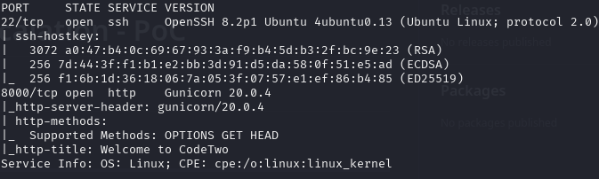
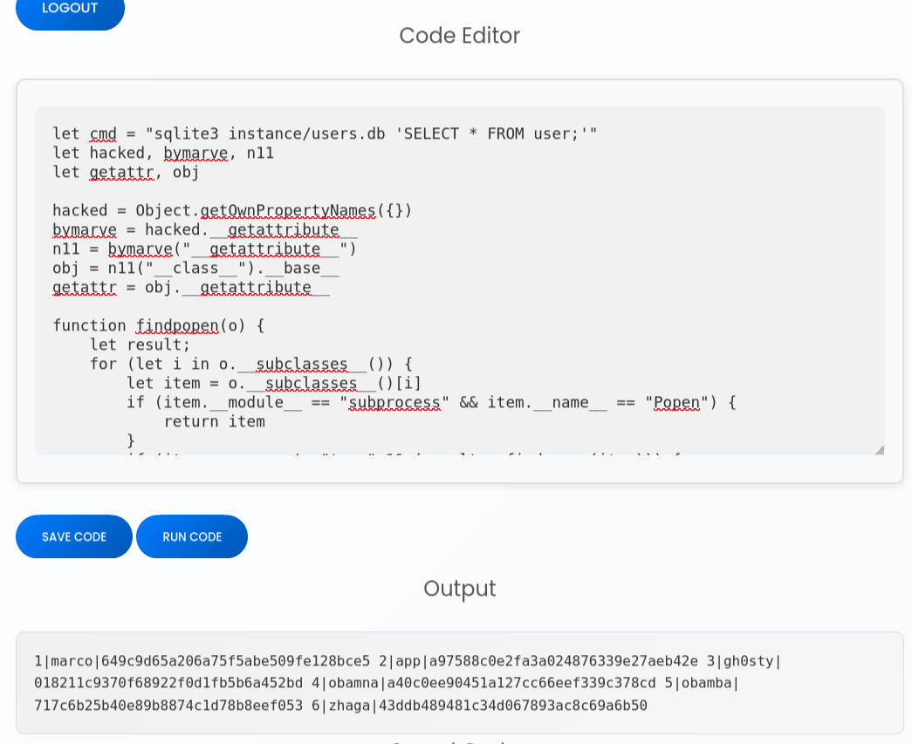
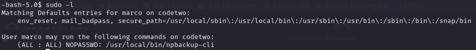
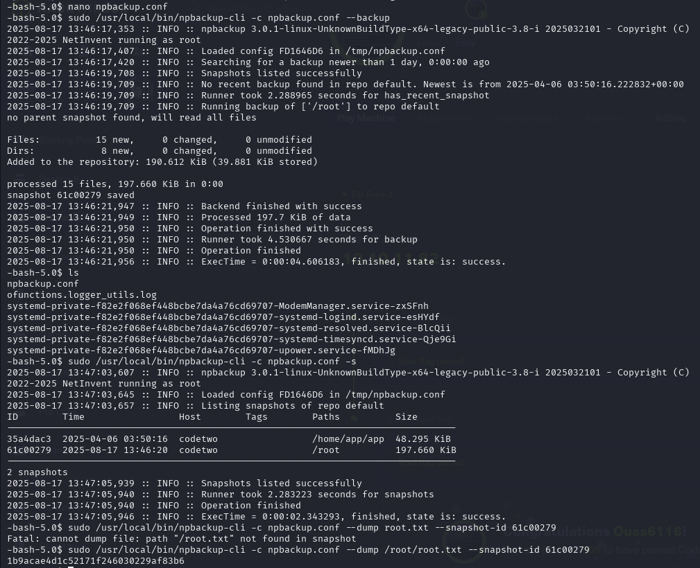

# CodeTwo (Easy): 10.10.11.80


---

## Quick Overview

A very easy and quick machine that can be pwned in two simple steps:

1. **js2py 0.74** → [CVE-2024-28397](https://github.com/waleed-hassan569/CVE-2024-28397-command-execution-poc) - *Thanks to @waleed-hassan569* → **USER.TXT**

2. **npbackup 3.0.1** → [npbackup 3.0.1 PrivEsc](https://github.com/AliElKhatteb/npbackup-cli-priv-escalation) - *Thanks to @AliElKhatteb* → **ROOT.TXT**

---

## USER.TXT

### Enumeration and Entry Point

We start with an **nmap** scan that reveals **port 8000**.



This part consists of a few steps:

1. Download the app and inspect the `requirements.txt` file to discover it uses **js2py==0.74**.  
   We then exploit the vulnerability [CVE-2024-28397](https://github.com/waleed-hassan569/CVE-2024-28397-command-execution-poc) to achieve remote code execution.

2. In the `instance/` directory, there is a **users.db** file. This will be useful later.

3. After registering a user, we exploit the js2py vulnerability to extract user information from the database: `sqlite3 instance/users.db 'SELECT * FROM user;'`



### Thank You, Marco

After retrieving Marco's credentials, we use [CrackStation](https://crackstation.net/) to crack the password and obtain **USER.TXT**.

---

## ROOT.TXT

### First discovery:

We run `sudo -l` and see that we have sudo access to **npbackup 3.0.1**.



After a quick search, we find this [Privilege Escalation PoC.](https://github.com/AliElKhatteb/npbackup-cli-priv-escalation)

### Privilege Escalation with npbackup:

Following the instructions, we can escalate to root and grab **ROOT.TXT**:

```bash
sudo /usr/local/bin/npbackup-cli -c npbackup.conf --backup  #Create a backup
sudo /usr/local/bin/npbackup-cli -c npbackup.conf -s #List snapshot IDs
sudo /usr/local/bin/npbackup-cli -c npbackup.conf --dump FILE --snapshot-id SNAP ID #Read file from backup
```

This allows us to read any file from the backup, including sensitive ones.


