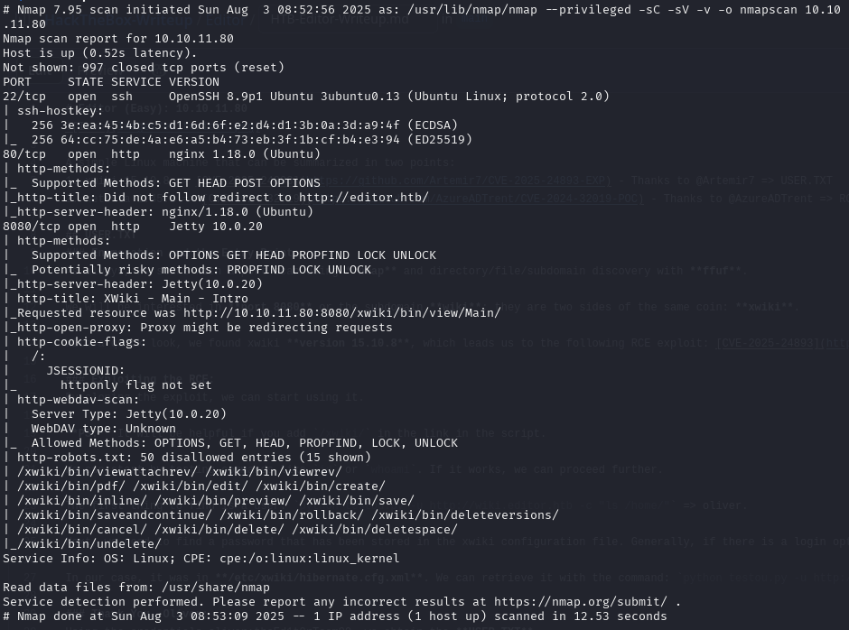
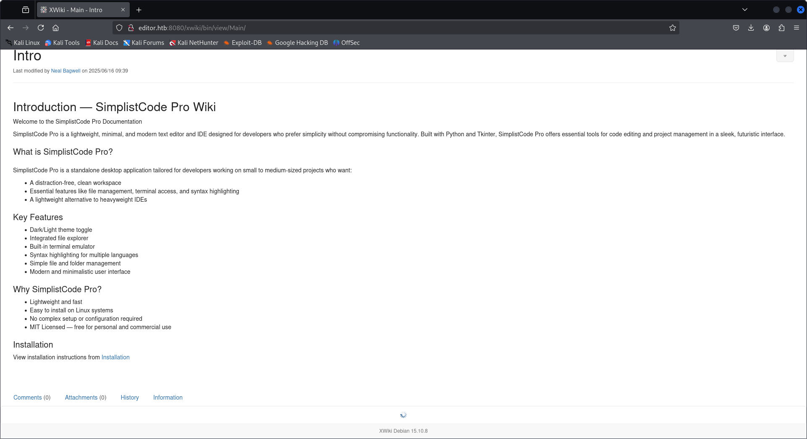
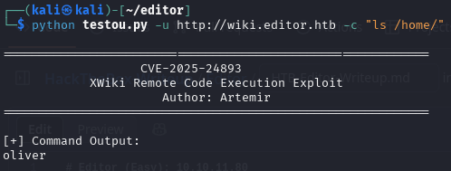
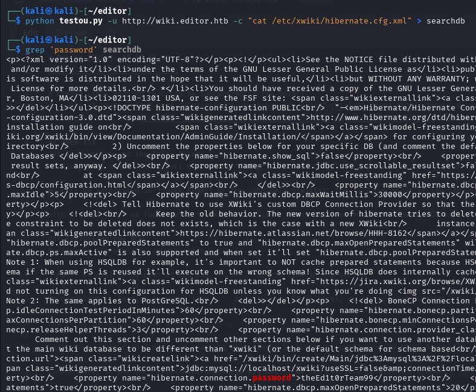
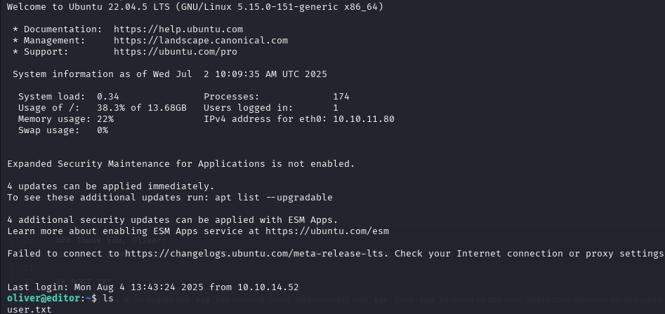
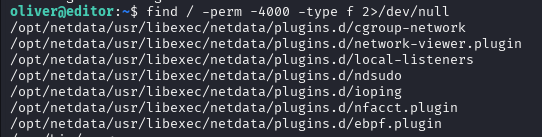
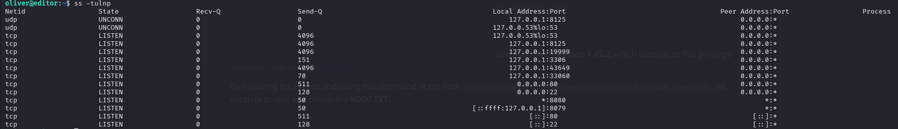
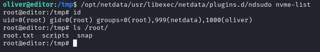

# Editor (Easy): 10.10.11.80

## Quick Overview

A simple Linux machine that can be summarized in two points:
1. xwiki 15.10.8 => [CVE-2025-24893](https://github.com/Artemir7/CVE-2025-24893-EXP) - Thanks to @Artemir7 => USER.TXT
2. netdata 1.45.2 => [CVE-2024-32019](https://github.com/AzureADTrent/CVE-2024-32019-POC) - Thanks to @AzureADTrent => ROOT.TXT

## USER.TXT
### Enumeration and the Entry Point:
As always, we start with a port scan using **nmap** and directory/file/subdomain discovery with **ffuf**.

We will be interested in **port 8080** or the subdomain **wiki**; they are two sides of the same coin: **xwiki**.

With a quick look, we found xwiki **version 15.10.8**, which leads us to the following RCE exploit: [CVE-2025-24893](https://github.com/Artemir7/CVE-2025-24893-EXP).

### Exploiting the RCE:
By cloning the exploit, we can start using it.

**PS:** It will be helpful if you add `/xwiki/` in the link in the script.

We can start by testing commands like `id` or `whoami`. If it works, we can proceed further.

The first thing to find is a user: `python testou.py -u http://wiki.editor.htb -c "ls /home/"` => oliver.

Next, we need to find a password that has been stored in the xwiki configuration file. Generally, if there is a login option, it means there are stored passwords somewhere.

In our case, it was in **/etc/xwiki/hibernate.cfg.xml**. We can retrieve it with the command: `python testou.py -u http://wiki.editor.htb -c "cat /etc/xwiki/hibernate.cfg.xml"` => theEd1t0rTeam99.

### Thank You, Oliver:
Using the credentials oliver:theEd1t0rTeam99, we obtain the **USER.TXT**.

## ROOT.TXT
### First Steps:
Let's start with **SUID**: `find / -perm -4000 -type f 2>/dev/null`. We can see that we have access to **Netdata**.

Next, we check the **accessible local ports**: `ss -tulnp`. We find **port 19999**, which is the one that Netdata uses.

The next step is **SSH port forwarding**: `ssh -L 7777:localhost:19999 oliver@editor.htb`.

### Netdata Exploit:

By accessing the Netdata web page, we found an alert about an outdated agent with **version 1.45.2**, which leads us to this privilege escalation exploit: [CVE-2024-32019](https://github.com/AzureADTrent/CVE-2024-32019-POC).

By following the exploit and using this command at the end: `/opt/netdata/usr/libexec/netdata/plugins.d/ndsudo nvme-list`, we escalate to root and obtain the **ROOT.TXT**.

